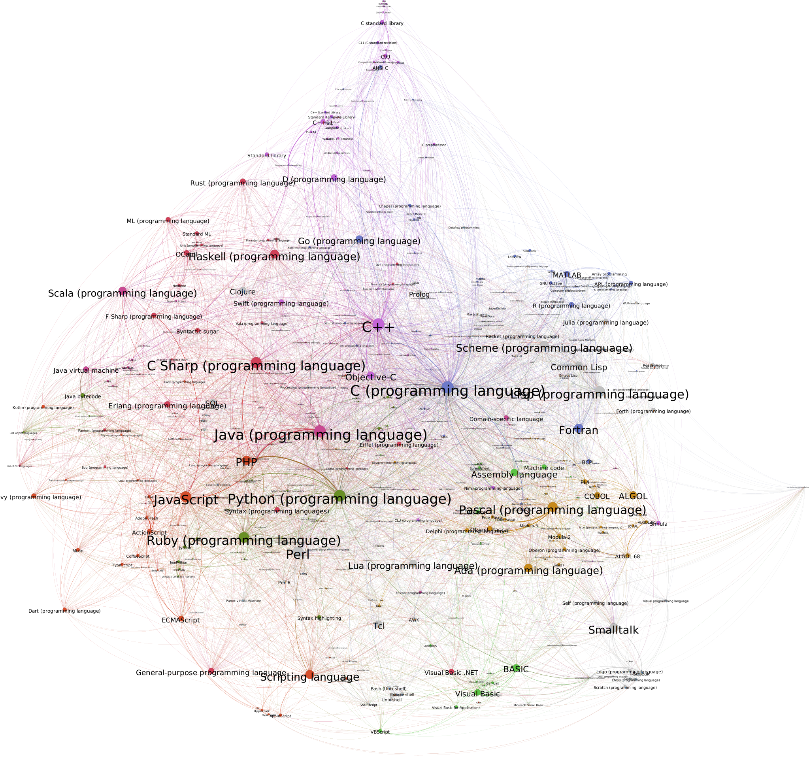

# Wikimap : wikipedia graphing tool

Transform a wikipedia XML dump of articles into [GEXF graph format](), suitable for plotting with e.g. [Gephi](https://gephi.org/ "Gephi's homepage"). Jump to the [gallery](#gallery) or look into the [images dir](./images) for examples of final graphs! The next section explains how to make your own graphs.

## Usage

### Download Wikipedia articles

* Use [Wikipedia's export form](https://en.wikipedia.org/wiki/Special:Export) to download the articles and categories that interest you. 
* Alternatively, this repo includes a perl script that fills out the form for you, and with which you can download the contents of a category and subcategories with depth as a parameter. You'll need a perl distribution, and the modules `Set::Light`, `Set::Scalar` and `WWW::Mechanize`, which you can [install from CPAN](http://www.cpan.org/modules/INSTALL.html). Example usage:
```shell
$ src/pageretriever.pl -o output.xml -d 1 Category:Formal_languages # Downloads the category and subcategories
Done downloading 411 articles from 11 Wikipedia categories
```

### Transform and process the graph
* You'll need a Scala interpreter for that to work. Transform the dump into GEXF with
  ```shell
  $ src/XmlGraphMaker.scala -i <your xml dump> -o <your output file>
  ```
  The graph is created in the following way:
  * Each node represents an article
  * Each edge (directed) represents a link from a wiki page to another page
  * Edges are weighted according to the number of links that link the same articles
  * Links pointing to an article which is not contained in the set of nodes are discarded


* Open the generated graph file with Gephi and process it as you like, then export your image for others to see!


## Gallery

Gephi allows you to make some pretty impressive graphs! Here's the baseline with which I processed the graphs below:
* Color the nodes according to modularity class
* Size the nodes according to the inbound degree/ centrality
* Spatialise with Force Atlas 2 until the graph stabilises

Then you can fiddle with node placement, filter out smaller nodes if there are too many, delete nodes that add too much noise (eg the main article of a category, to which nearly every article links, or list articles, which have many outbound links)... whatever looks best! 

### Programming languages


Full graph.


### Linguistics + formal languages

Full graph.
![Full linguistics graph][full-linguistics]
Snapshot : middle right black cluster.
![Sociolinguistics cluster][sociolinguistics]
Snapshot : middle left orange cluster.
![Formal languages cluster][formal_languages]

[programming-languages]: ./images/programming-languages-1.svg "Programming languages category, depth of 1"
[phonology]: ./images/phonology.png "Detail : phonology"
[sociolinguistics]: ./images/sociolinguistics.png "Detail : sociolinguistics"
[formal_languages]: ./images/formal_languages.png "Detail : formal languages"
[full-linguistics]: ./images/full-linguistics.png "Full subset graph, with articles from linguistics-related categories"
